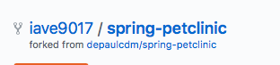
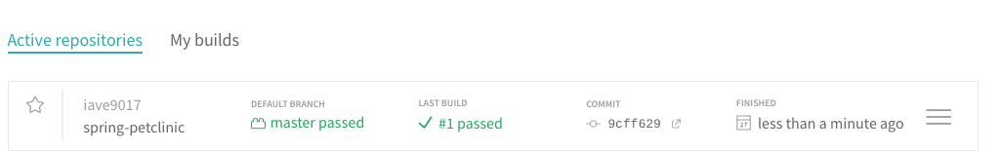
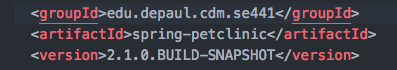
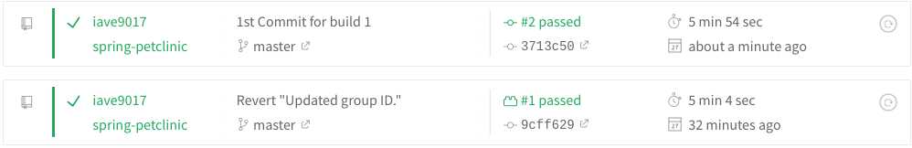
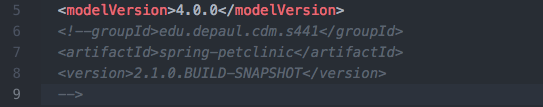
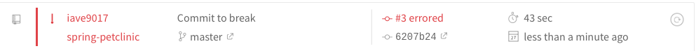
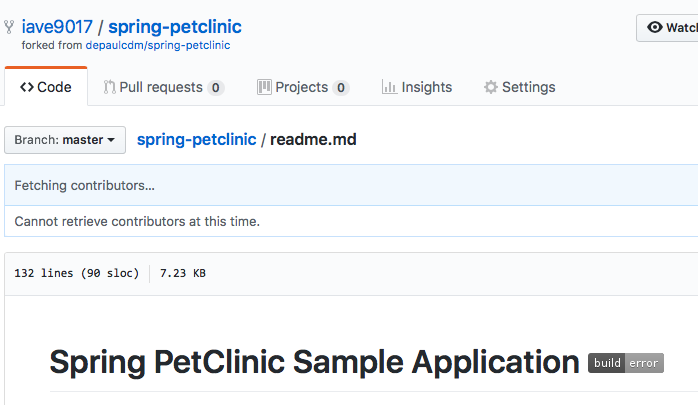
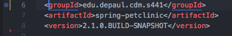
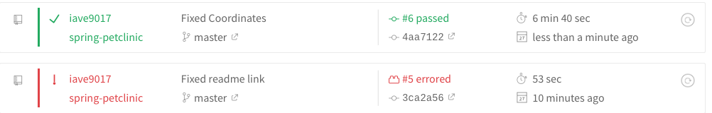
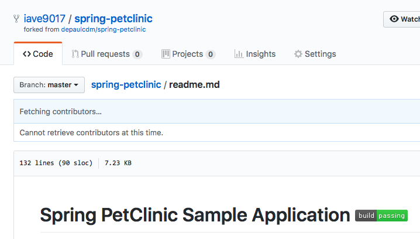

QUESTION 1

QUESTION2

QUESTION3

QUESTION4

QUESTION5

QUESTION6

QUESTION7

QUESTION8

QUESTION9

NOTE: Had to do an extra push or two to make sure my links were working on github, which is why there is a greater number of builds than previous.

QUESTION10

